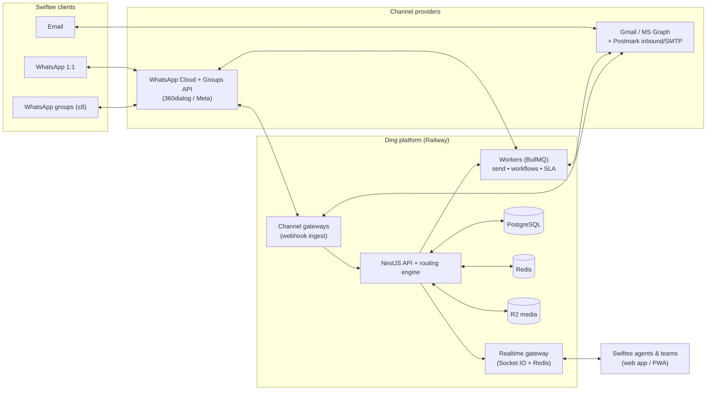

# Ding — Swiftee's Omnichannel Platform

> A sleek, WhatsApp-native team inbox for Swiftee. Unifies **WhatsApp Business** (1:1 and small client **groups**), **shared email inboxes**, teams, routing, and (later) workflows — with realtime, multiplayer UX.

This repository currently holds the **product + technical plan**. No application code has been written yet — these docs are the blueprint we build from.

---

## The 60-second summary

Ding is a **team inbox** in the family of Front / Missive / Intercom / Chatwoot, but **WhatsApp-first** and built for Swiftee's way of working: every client conversation — whether it arrives on WhatsApp, in a WhatsApp group, or by email — lands in one fast, modern app where the right person or team picks it up.

**Two things make it "ours" and not a clone:**
1. **A two-section sidebar** — a personal **My Inbound** space (what's assigned to me + inbound my team hasn't picked up yet) sitting above **Shared Inboxes** (team-owned WhatsApp numbers, group spaces and email addresses you can create and route on the fly).
2. **Multiplayer, realtime everything** — WhatsApp-speed delivery, typing/read receipts, live presence and collision detection so two agents never talk over each other, plus an internal collaboration lane ("chat about the chat") beside every client thread.

## The single most important decision

**Go 100% official on WhatsApp.** As of 2026, Meta ships an official **Groups API** (small groups, ≤8 members, invite-link join, up to 10,000 groups per number). This means Swiftee's "groups with clients" requirement can be met **on the compliant WhatsApp Business Platform** — we do **not** need Baileys / whatsapp-web.js, which remain a Terms-of-Service violation and, per 2026 field data, get numbers **banned within 2–8 weeks**. Betting the business's primary channel on a ban-prone grey-market library would be a mistake. See [`docs/03-channels.md`](docs/03-channels.md).

> ⚠️ **The one thing to validate first:** official WhatsApp groups are capped at **8 members**. That's fine for high-touch client rooms (client + a couple of their people + Swiftee reps). If Swiftee needs large community groups, no compliant path exists and we'd re-scope. Confirm the real group size before Phase 4.

---

## Recommended stack (at a glance)

| Layer | Choice | Why |
|---|---|---|
| **Frontend** | React + TypeScript (Vite), Tailwind + shadcn/ui, Framer Motion, TanStack Query/Router/Virtual, Tiptap composer, cmdk (⌘K) | App-like, instant, accessible; the polish budget goes into the "WhatsApp-with-a-twist" UI |
| **Backend** | Node + TypeScript monorepo (pnpm + Turborepo), NestJS API, Socket.IO WebSocket gateway, BullMQ workers | One language end-to-end; structured for a growing platform; battle-tested realtime |
| **Data** | PostgreSQL 16 (primary), Redis (pub/sub, presence, queues, cache), Cloudflare R2 (media), Postgres FTS → Typesense (search) | Boring, proven, cheap to run; scales when we need it |
| **Channels** | WhatsApp **Cloud API + Groups API** (via 360dialog or Meta-direct BSP); Email via Gmail/Microsoft Graph OAuth + Postmark inbound/SMTP | Compliant, official, reliable threading |
| **Realtime** | Socket.IO + Redis adapter (self-host) — managed Ably/Pusher as the escape hatch | Presence, typing, read receipts, live assignment at WhatsApp speed |
| **Automation** | In-house rules engine on BullMQ → Inngest/Temporal if flows get long-running | Start simple, graduate deliberately |
| **Infra** | **Railway** (services + Postgres + Redis), Cloudflare (DNS/CDN/R2/WAF), GitHub Actions CI/CD | Matches Swiftee's existing tooling; per-PR preview envs |
| **Auth** | WorkOS or Clerk (B2B SSO/SAML + RBAC) | Enterprise-ready without building auth |
| **Observability** | OpenTelemetry + Grafana/Better Stack, Sentry, pino logs | See problems before customers do |

Full rationale and alternatives in [`docs/02-architecture.md`](docs/02-architecture.md).

---

## System context

---

## How to read these docs

Read in order for the full story, or jump to what you need:

| # | Doc | What's inside |
|---|---|---|
| 01 | [Product & UX](docs/01-product-and-ux.md) | Vision, personas, the "twist", the two-section sidebar spec, screens & interactions |
| 02 | [Architecture & Tech](docs/02-architecture.md) | Full tech map, service architecture, realtime/event model, sequence diagrams |
| 03 | [Channels](docs/03-channels.md) | WhatsApp (Cloud + Groups API, templates, windows, pricing) and Email (shared inboxes, threading) |
| 04 | [Data Model](docs/04-data-model.md) | Entities, ER diagram, conversation state machine, multi-tenancy, identity resolution |
| 05 | [Routing, Teams & Workflows](docs/05-routing-teams-workflows.md) | Teams, inboxes, routing engine, **My Inbound** semantics, automation engine |
| 06 | [Roadmap](docs/06-roadmap.md) | Phased delivery, milestones, team shape, timeline |
| 07 | [Infra, Security & Cost](docs/07-infra-security-cost.md) | Railway infra, UK GDPR + WhatsApp compliance, observability, cost model |

---

## Open decisions to confirm before build

1. **Real WhatsApp group size** — does ≤8 members cover Swiftee's client groups? (Gates Phase 4.)
2. **BSP** — 360dialog (fast, WhatsApp-focused) vs Meta-direct (cheapest, more setup) vs Twilio (broad, pricier).
3. **Realtime** — self-hosted Socket.IO+Redis (chosen default, full control) vs managed Ably/Pusher (less ops, per-message cost).
4. **Build bespoke vs fork Chatwoot** — bespoke recommended for the UX bar Swiftee wants; the decision is argued in [`docs/02-architecture.md`](docs/02-architecture.md).
5. **Auth vendor** — WorkOS vs Clerk vs self-hosted.

_These are the forks that change what we build next; everything else is reversible._
