# 01 · Product & UX

## Vision

> **One fast, beautiful place where every Swiftee client conversation lives — and always reaches the right person.**

Swiftee talks to clients across WhatsApp (1:1 and small groups) and email. Today those live in separate apps, on personal phones, in individual inboxes — invisible to the team, impossible to route, easy to drop. Relay replaces that with a **shared, realtime team inbox** that feels as immediate as WhatsApp but works like a professional operations tool: teams, ownership, routing, SLAs, and collaboration.

The product bar is **"nicer to use than WhatsApp itself"** — because agents live in it all day.

## Who it's for (personas)

| Persona | Needs | What Relay gives them |
|---|---|---|
| **Agent** (front-line, handles clients all day) | Speed, keyboard-first, never lose a message, know what's "mine" | My Inbound, ⌘K everything, instant send, snooze, canned replies |
| **Team lead / manager** | Load balancing, visibility, reassign, SLAs | Shared inboxes, routing rules, reassignment, live team presence, reporting |
| **Admin / ops** | Connect channels, define teams, set policy | Create inboxes, team & routing config, workflows, compliance controls |
| **Client** (external) | Reach Swiftee the way they already do | Nothing to install — normal WhatsApp / group / email on their side |

## What makes it "WhatsApp with a twist"

We deliberately keep the **familiar WhatsApp feel** (left conversation list, right thread, bubbles, ticks, presence) so there's zero learning curve — then add the things WhatsApp can't do for a team:

1. **Two-section sidebar** — a personal **My Inbound** space above **Shared Inboxes**. You always know what's yours vs. what's the team's. _(Full spec below — this is the core of the request.)_
2. **Multiplayer presence & collision control** — Figma-style "Sarah is viewing", "James is typing to this client", soft-locks so two agents don't reply at once. Critical for shared inboxes.
3. **The internal lane** — beside every client thread is a private **team thread** ("chat about the chat") with @mentions. Discuss, tag a colleague, decide — the client never sees it.
4. **Unified client timeline** — WhatsApp, group, and email with the same contact merge into one **Client Space**. Switch channels inline; history is one story, not three apps.
5. **Command-bar routing (⌘K)** — assign, route to a team, snooze, insert a template, jump to any conversation/contact — without touching the mouse.
6. **Pull-to-take queues** — unassigned inbound for your team sits in a "up for grabs" lane; grab it and it's yours, live for everyone.
7. **AI assist (later)** — suggested replies, thread summaries, translation, draft-from-knowledge-base. Swiftee can wire this to Claude. Positioned as an accelerator, never an auto-pilot.

## Information architecture

```mermaid
flowchart TD
    App["Relay app shell"] --> Nav["Left rail (icons)"]
    App --> Sidebar["Sidebar (2 sections)"]
    App --> List["Conversation list"]
    App --> Thread["Conversation view"]
    App --> Panel["Context panel"]

    Nav --> N1["Inbox • Contacts • Insights • Settings • Avatar/Presence"]

    Sidebar --> S1["① MY SPACE"]
    Sidebar --> S2["② SHARED INBOXES"]

    S1 --> M1["My Inbound (default)"]
    S1 --> M2["Mine · assigned to me"]
    S1 --> M3["Up for grabs · my teams' inbound"]
    S1 --> M4["@Mentions"]
    S1 --> M5["Snoozed · Drafts · Sent · All mine"]

    S2 --> I1["Team views (Sales, Support…)"]
    S2 --> I2["WhatsApp: +44… number"]
    S2 --> I3["WhatsApp Groups: client spaces"]
    S2 --> I4["Email: support@ , hello@ …"]
    S2 --> I5["+ Create inbox / route"]

    Thread --> T1["Client thread (bubbles, ticks, media)"]
    Thread --> T2["Internal lane (notes, @mentions)"]
    Thread --> T3["Composer (WA / email aware)"]

    Panel --> P1["Contact + company"]
    Panel --> P2["Assignment & team"]
    Panel --> P3["Labels • priority • SLA"]
    Panel --> P4["Channel history / other threads"]
```



### The layout (four columns)

```
┌────┬─────────────────────┬───────────────────────────┬──────────────────┐
│ 🧭 │  SIDEBAR            │  CONVERSATION             │  CONTEXT PANEL   │
│    │                     │                           │                  │
│ 📥 │ ① MY SPACE          │  ┌─ client thread ─────┐  │  👤 Acme Ltd     │
│ 👥 │   📌 My Inbound  12 │  │  bubbles, media,    │  │  ☎ +44 7…        │
│ 📊 │   • Mine          4 │  │  ✓✓ read receipts   │  │  ✉ ops@acme…     │
│ ⚙  │   • Up for grabs  8 │  │                     │  │                  │
│    │   • @Mentions     1 │  └─────────────────────┘  │  Assigned: me    │
│ 🟢 │                     │  ┌─ internal lane ─────┐  │  Team: Support   │
│    │ ② SHARED INBOXES    │  │  @james can you…    │  │  Priority: High  │
│    │   Sales          23 │  └─────────────────────┘  │  SLA: 1h 12m ⏳   │
│    │   Support         7 │  ┌─ composer ──────────┐  │  Labels: VIP     │
│    │   📱 +44 20 … WA  3 │  │ [WhatsApp ▾] type…  │  │                  │
│    │   💬 Acme space   1 │  │ 📎 😊 ⚡template  ➤ │  │  ↕ Other threads │
│    │   ✉ support@…     4 │  └─────────────────────┘  │   • Email (2)    │
│    │   + Create inbox    │                           │   • Group (1)    │
└────┴─────────────────────┴───────────────────────────┴──────────────────┘
```

## The sidebar — detailed spec (the heart of the request)

### Section ① — My Space (personal)

The agent's home. Everything here is scoped to **me**.

- **My Inbound** *(default landing view)* — the union of:
  - **Mine** — conversations where `assignee = me` and status is open/pending.
  - **Up for grabs** — conversations that are **unassigned**, sitting in an inbox owned by **a team I belong to**, and eligible for me under that team's routing rules (i.e. "inbound waiting for someone to take that is meant for me"). Taking one assigns it to me instantly, for everyone.
  - Badge = count needing my attention (unread + newly assigned).
- **Sub-filters** under My Inbound: `Mine` · `Up for grabs` · `@Mentions` · `Following` · `Snoozed` · `Drafts` · `Sent`.
- Ordering: newest activity first, with **priority** and **SLA-at-risk** floated to the top.

> **Semantics that matter:** "My Inbound" is a *computed view*, not a folder. A conversation moves in/out of it in realtime as assignment, status, and team membership change. The exact query is defined in [`docs/05-routing-teams-workflows.md`](05-routing-teams-workflows.md).

### Section ② — Shared Inboxes (team)

The team's shared surfaces. Visibility is permission-scoped (you only see inboxes your teams can access).

- **Team views** — e.g. *Sales*, *Support* — aggregate all inboxes that team owns, with quick filters `Open · Unassigned · Pending · Snoozed · Closed`.
- **Individual inboxes**, each with an unread/needs-attention badge:
  - 📱 **WhatsApp number** (a WABA phone) — e.g. `+44 20 …`
  - 💬 **WhatsApp group spaces** — small client rooms (≤8), shown as named "spaces" (e.g. *Acme space*).
  - ✉ **Email addresses** — shared mailboxes (e.g. `support@`, `hello@`).
- **+ Create inbox** — a first-class action: connect a new WhatsApp number, create/adopt a group space, or connect an email address; then pick **owning team(s)** and a **routing strategy**. Creating and routing an inbox is a 60-second flow, not an IT ticket.
- **Route / move** — from any conversation, reassign to another **team** or **agent** (⌘K or right-click). Updates everyone's views live and writes an audit entry.

### States, badges & realtime

- Per-item badges: unread count, "assigned to you", SLA-at-risk (amber), breached (red), snoozed (moon), draft (pencil).
- **Presence**: avatars of who's currently viewing/typing on a conversation; a soft-lock warning if you start replying to a conversation someone else is actively answering.
- Everything updates **live** — new inbound, reassignment, status change, another agent taking an "up for grabs" item — no refresh, ever.

## Key screens & flows

| Screen | Purpose | Notable interactions |
|---|---|---|
| **Inbox** (default) | The four-column workspace above | Keyboard nav (`j/k`, `e` archive, `a` assign, `s` snooze), ⌘K, drag-to-reassign |
| **Conversation** | Client thread + internal lane + composer | Channel-aware composer (WhatsApp vs email); template picker with 24h-window awareness; media drop; read receipts |
| **Create inbox** | Connect a channel & route it | WhatsApp Embedded Signup / email OAuth / group create; assign owning team + routing strategy |
| **Contact / Client Space** | One client, all channels | Merged timeline (WA + group + email), company, past conversations, notes |
| **Team & routing settings** | Admin config | Team membership, routing strategy per inbox, business hours, SLA targets |
| **Workflows** (later) | Automation builder | Trigger → conditions → actions, dry-run, versioning |
| **Insights** | Reporting | Volume, response/resolution times, SLA attainment, per agent/team/inbox |

## Composer behaviour (channel-aware)

The composer adapts to the conversation's channel — a subtle but important "twist":

- **WhatsApp / group**: plain text + emoji + media; **24-hour window indicator**. If the window is closed, the composer switches to a **template picker** (only approved templates) and explains why. Formatting maps to WhatsApp's `*bold*` / `_italic_`.
- **Email**: rich text (Tiptap), subject line, cc/bcc, signature, quoted history, attachments. Threading is automatic.
- **Internal note**: visually distinct (amber lane), `@mention` autocomplete, never delivered to the client.
- Shared drafts + "someone else is replying" collision warning in all modes.

## Design language

- **Familiar skeleton, elevated craft.** WhatsApp's spatial model (list ↔ thread) so it's instantly usable; a cleaner, more spacious, more "product" aesthetic than consumer WhatsApp.
- **Tailwind + shadcn/ui (Radix)** for accessible, consistent primitives; **Framer Motion** for the small, fluid transitions (thread open, send, reassignment) that make it feel alive.
- **Dark & light**, system-aware. Density toggle (comfortable/compact) for power agents.
- **Tokens first** — a small design-token set (color, spacing, radius, motion) shared across app and future mobile so everything stays coherent. A Figma library mirrors these tokens.
- **Accessibility** — full keyboard operation, focus states, ARIA, reduced-motion honoured. Agents use this 8 hours a day; it has to be comfortable and inclusive.

## Non-goals (for v1)

- Voice/video calling, SMS, Instagram/Messenger (design the channel abstraction to allow them later — don't build them now).
- A public help-centre / knowledge base (can integrate later; AI-draft can read from it).
- Large WhatsApp community groups (not possible compliantly — see channels doc).
- A full CRM — Relay owns conversations and light contact data; it integrates with a CRM rather than replacing one.
