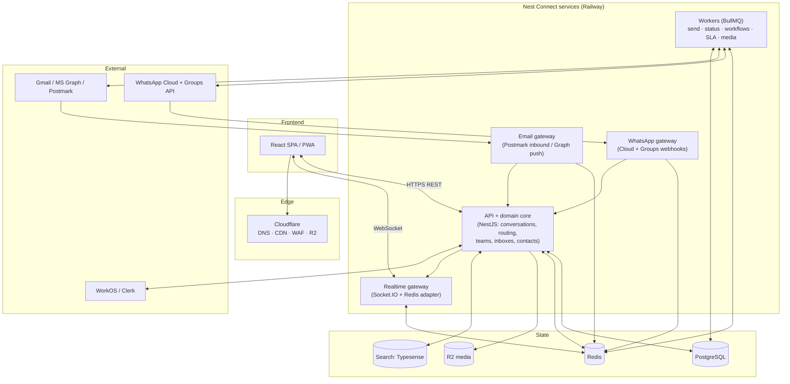
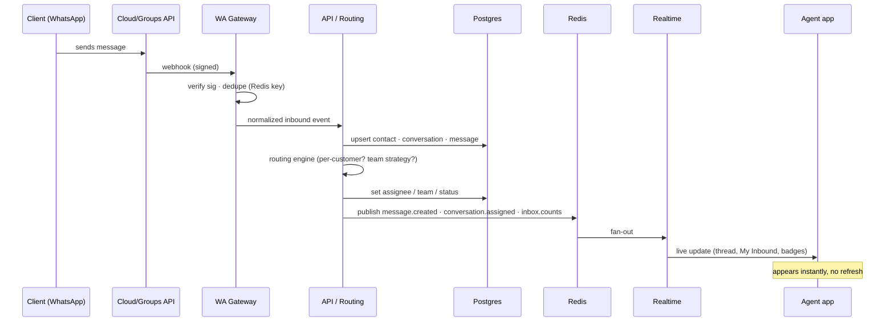
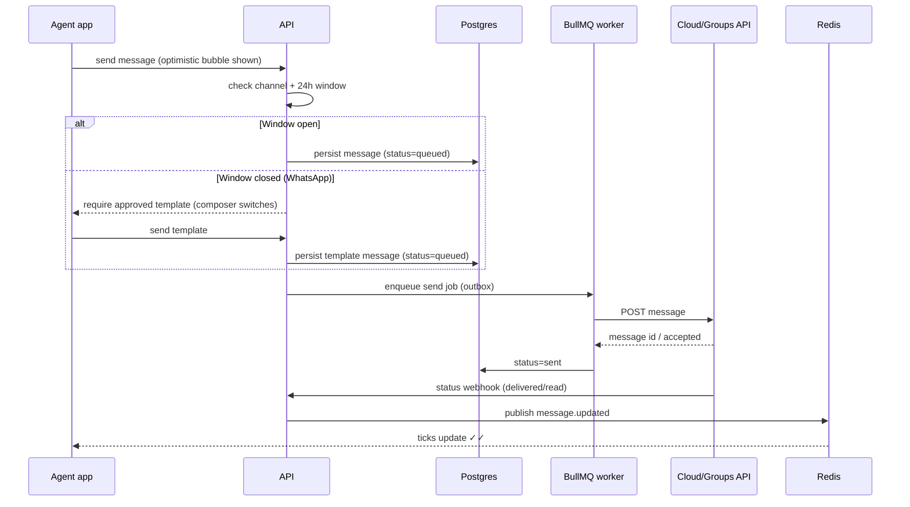
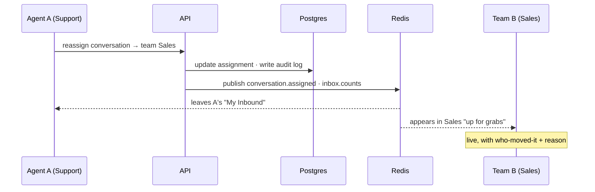

# 02 · Architecture & Tech

## Principles

1. **Realtime is the product.** Message delivery, presence, typing, read receipts and live assignment must feel WhatsApp-instant. Every design choice is judged against this.
2. **One language end-to-end.** TypeScript across frontend, backend, and shared schemas — one talent pool, shared types, less glue.
3. **Boring core, sharp edges.** PostgreSQL + Redis + a queue is enough to go a very long way. Spend novelty budget on UX and the channel layer, not on exotic infrastructure.
4. **Channel-agnostic core.** Conversations, routing and the inbox don't know or care whether a message came from WhatsApp, a group, or email. Channels are adapters at the edge.
5. **Reversible decisions first.** Managed vendors (auth, realtime) where they buy speed; keep the core portable so we can bring things in-house when scale justifies it.

## Build bespoke vs. fork Chatwoot

Chatwoot (open-source Rails team-inbox) solves ~60% of the backend concepts here and would save months. But Swiftee's headline requirement is a **best-in-class, WhatsApp-native, multiplayer UX** and a specific IA (the two-section sidebar, client spaces, internal lane). Retrofitting that onto Chatwoot's Rails/ViewComponent frontend fights the framework, and its data model doesn't natively express WhatsApp *groups* or our "up for grabs" routing.

**Recommendation: build bespoke**, but treat Chatwoot (and Front/Missive) as reference architectures — borrow their proven concepts (inboxes, conversation states, assignment, canned responses) rather than their code. If speed-to-first-revenue ever outranks UX, a Chatwoot fork is the fallback. This is decision #4 in the README.

## Tech stack — the full map

### Frontend

| Concern | Choice | Notes / alternatives |
|---|---|---|
| Framework | **React 18 + TypeScript**, built with **Vite** | App-like SPA, not a content site → Vite over Next.js. (Next.js only if we later need heavy SSR/marketing.) |
| Routing | **TanStack Router** | Type-safe routes/search params; React Router is the safe alternative |
| Server state | **TanStack Query** | Caching, background refetch, optimistic updates, offline |
| Client/UI state | **Zustand** | Small, unopinionated store for UI + realtime message cache |
| Styling | **Tailwind CSS** + **shadcn/ui** (Radix) | Accessible primitives, full design control, fast iteration |
| Motion | **Framer Motion** | The fluid WhatsApp-like micro-interactions |
| Long lists | **TanStack Virtual** | Smooth 10k-message threads and huge conversation lists |
| Composer | **Tiptap** (ProseMirror) | Rich email + WhatsApp-aware formatting, mentions, attachments |
| Command palette | **cmdk** | ⌘K routing/assign/jump |
| Forms/validation | **React Hook Form + Zod** | Zod schemas shared with the backend |
| Realtime client | **Socket.IO client** | Rooms, auto-reconnect, delta catch-up |
| Delivery | **PWA + Web Push** now; **Expo (React Native)** later | Desktop-notify agents; native mobile in Phase 6 |

> **Instant-UX escape hatch:** if hand-rolled optimistic updates + WS sync ever get painful, evaluate a sync engine (**Rocicorp Zero**, **ElectricSQL**, or **Convex**) that gives local-first, conflict-resolved state. Powerful, but adds a paradigm; not needed for v1.

### Backend

| Concern | Choice | Notes / alternatives |
|---|---|---|
| Runtime/language | **Node.js LTS + TypeScript** | Shared types with frontend |
| Monorepo | **pnpm workspaces + Turborepo** | `apps/*` and `packages/*` (shared `zod` schemas, types, UI) |
| API framework | **NestJS** | DI, modules, structure for a growing team; **Fastify + tRPC** is the leaner alternative |
| API surface | **REST + OpenAPI** (typed client generated) or **tRPC** | tRPC for internal speed; OpenAPI if we expose a public API |
| Realtime gateway | **Socket.IO** + **@socket.io/redis-adapter** | Horizontal scale via Redis pub/sub; presence via Redis |
| Background jobs | **BullMQ** (Redis) | Outbound send, webhook processing, retries, snooze/SLA timers, workflow steps |
| Channel gateways | Dedicated ingest workers per channel | Verify + dedupe + normalize webhooks, then enqueue |
| ORM | **Prisma** | Best DX + migrations; **Drizzle** if we want tighter SQL/perf control |
| Validation | **Zod** everywhere | One schema, reused for API, forms, and events |
| Auth | **WorkOS** or **Clerk** | B2B SSO/SAML, RBAC, SCIM; self-host with Lucia is the fallback |

### Data & storage

| Concern | Choice | Notes |
|---|---|---|
| Primary DB | **PostgreSQL 16** (Railway managed) | Multi-tenant (`org_id` everywhere); partition `messages` by time at scale |
| Cache / pub-sub / presence | **Redis** (Railway) | Socket.IO adapter, presence sets, rate limits, idempotency keys, BullMQ |
| Object storage | **Cloudflare R2** | S3-compatible, **no egress fees**; signed URLs for media/attachments |
| Search | **Postgres FTS** (tsvector + `pg_trgm`) → **Typesense**/**Meilisearch** | Start in-DB; graduate to instant typo-tolerant search |
| Analytics store | Postgres materialized views → **ClickHouse** later | Reporting without hammering OLTP |

### Cross-cutting

| Concern | Choice |
|---|---|
| Observability | **OpenTelemetry** traces/metrics → Grafana Cloud or Better Stack; **Sentry** errors; **pino** structured logs |
| CI/CD | **GitHub Actions** → **Railway** deploys; per-PR preview environments |
| Secrets | Railway variables / **Doppler** |
| Testing | **Vitest** (unit), **Playwright** (e2e), **k6** (realtime/load), webhook contract tests |
| Feature flags | Railway config or **Unleash**/**Flagsmith** |

## Service architecture

Start as a **modular monolith** (one NestJS app, clean module boundaries) plus a small number of separately-scaled processes. Split modules into services only when load or team size demands it — the module boundaries make that painless.



**Why these seams:**
- **Channel gateways are separate** so a webhook storm (or a provider outage/retry flood) can't take down the API. They do one job: verify signature → dedupe (idempotency key in Redis) → normalize → enqueue/hand to the domain core.
- **Realtime gateway is separate** so we scale WebSocket fan-out independently of request/response API load; Redis is the backplane between nodes.
- **Workers are separate** so outbound sending, media processing, workflow execution and SLA timers run off the request path with retries and backoff.

## Realtime & event model

The core is a small set of **domain events** published to Redis and fanned out to clients over WebSocket rooms.

**Rooms a client subscribes to:** `user:{id}`, `org:{id}`, `team:{id}` (per membership), `inbox:{id}` (per access), and `conversation:{id}` (when open).

**Event catalogue (illustrative):**

| Event | Emitted when | Consumers update |
|---|---|---|
| `message.created` | Inbound or outbound message persisted | Thread, list preview, inbox/My-Inbound counts |
| `message.updated` | Delivery/read status changes (WA ticks) | Message ticks |
| `conversation.created` | New conversation opened in an inbox | Lists, "up for grabs" queues |
| `conversation.assigned` | Assignment/reassignment (auto or manual) | My Inbound in/out, shared inbox, presence |
| `conversation.status_changed` | open/pending/snoozed/closed | Lists, filters, SLA |
| `typing.start` / `typing.stop` | Agent or contact typing | Typing indicator |
| `presence.update` | Agent online/away, viewing a conversation | Avatars, collision soft-lock |
| `note.created` / `mention.created` | Internal lane activity | Internal lane, @mention badges |
| `inbox.counts` | Any count-affecting change | Sidebar badges |

**Delivery guarantees & catch-up:** every conversation carries a monotonic `seq`. Clients track the last `seq` they've seen; on reconnect they request the delta (`GET /conversations/:id/messages?since=seq`). So a dropped socket never loses messages — the socket is the fast path, the DB is the source of truth. Outbound sends use an **outbox pattern** (persist → enqueue → send → reconcile status) so a crash mid-send never double-sends or loses a message. Webhooks are **idempotent** (dedupe on provider message id).

## Key sequence flows

### Inbound WhatsApp message → agent sees it live



### Outbound send with 24-hour-window / template check



### Manual reassignment across teams



## Scaling path (only when needed)

| Signal | Move |
|---|---|
| WebSocket fan-out is the bottleneck | Scale realtime nodes horizontally (Redis adapter already supports it); or offload to managed **Ably/Pusher** |
| `messages` table hot | Time-based partitioning + archival to cold storage |
| Search slow / fuzzy | Move FTS → **Typesense**/**Meilisearch** cluster |
| Workflow volume / long-running flows | Adopt **Inngest** or **Temporal** for durable execution |
| One module dominates load | Extract it from the monolith into its own Railway service (boundaries already clean) |
| Reporting strains OLTP | Stream events to **ClickHouse**/warehouse |

## Repository layout (proposed)

```
ding/
├─ apps/
│  ├─ web/                 # React SPA / PWA
│  ├─ api/                 # NestJS: domain core + REST/WS
│  ├─ realtime/            # Socket.IO gateway (or a module in api early on)
│  ├─ gateway-whatsapp/    # WA Cloud + Groups webhook ingest
│  ├─ gateway-email/       # Postmark inbound / Graph push ingest
│  └─ workers/             # BullMQ processors
├─ packages/
│  ├─ schemas/             # Zod schemas + shared types (source of truth)
│  ├─ ui/                  # design system (tokens + shadcn components)
│  ├─ domain/              # entities, routing engine, state machines
│  └─ config/              # eslint, tsconfig, tailwind preset
├─ infra/                  # Railway config, Terraform (Cloudflare/DNS)
└─ docs/                   # this plan
```
