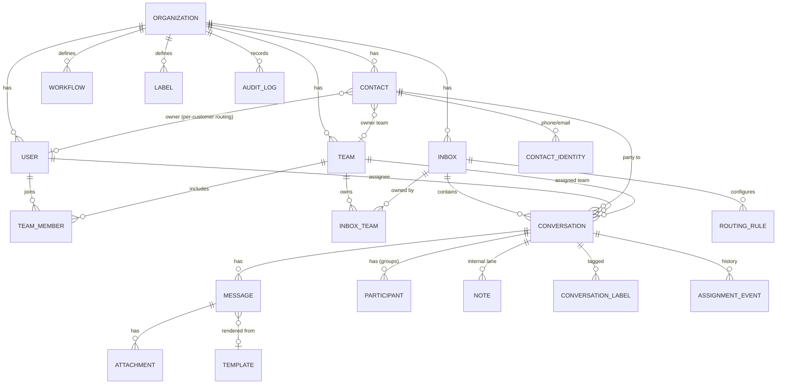
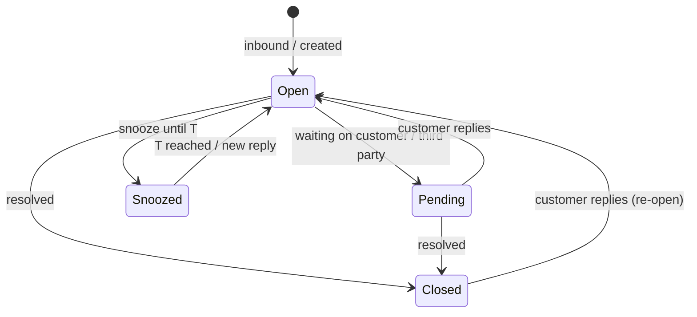

# 04 · Data Model

The data model is deliberately channel-agnostic: **Conversations**, **Messages**, **Inboxes**, **Contacts**, **Teams** and **Assignment** don't care whether the channel is WhatsApp, a WhatsApp group, or email.

## Entity-relationship overview



## Core entities

| Entity | Purpose | Key fields |
|---|---|---|
| **Organization** | Tenant (Swiftee; also each customer if we go multi-tenant SaaS) | `id`, `name`, `region`, `settings` |
| **User** | An agent/manager/admin | `id`, `org_id`, `name`, `email`, `role`, `presence`, `avatar` |
| **Team** | Group of users that owns inboxes and receives routing | `id`, `org_id`, `name`, `routing_defaults` |
| **TeamMember** | User↔Team membership (+ team role) | `user_id`, `team_id`, `role` |
| **Inbox** | A channel endpoint: a WABA number, a group space, or an email address | `id`, `org_id`, `type` (`whatsapp`\|`whatsapp_group`\|`email`), `channel_config`, `routing_strategy` |
| **InboxTeam** | Which team(s) own an inbox | `inbox_id`, `team_id` |
| **Contact** | Unified external customer identity | `id`, `org_id`, `display_name`, `company`, `owner_user_id?`, `owner_team_id?`, `attributes` |
| **ContactIdentity** | A channel handle belonging to a contact | `contact_id`, `kind` (`phone`\|`email`\|`wa_id`), `value` (E.164 / lowercased email), `verified` |
| **Conversation** | A thread in an inbox with a contact (or group) | `id`, `inbox_id`, `contact_id`, `status`, `assignee_user_id?`, `assigned_team_id?`, `priority`, `sla_due_at?`, `last_activity_at`, `seq`, `channel_ref` |
| **Participant** | Members of a group conversation (WhatsApp groups) | `conversation_id`, `contact_id`, `role`, `joined_at` |
| **Message** | One message in a conversation | `id`, `conversation_id`, `direction` (`in`\|`out`), `author_type` (`contact`\|`user`\|`system`), `author_id`, `body`, `channel_msg_id`, `status`, `template_id?`, `seq`, `created_at` |
| **Attachment** | Media/file on a message | `id`, `message_id`, `r2_key`, `mime`, `size`, `filename` |
| **Note** | Internal-lane message (never sent to client) | `id`, `conversation_id`, `author_id`, `body`, `mentions[]`, `created_at` |
| **Label / ConversationLabel** | Tags on conversations | `label_id`, `conversation_id` |
| **Template** | Approved WhatsApp template (HSM) | `id`, `name`, `category`, `language`, `body`, `variables`, `approval_status` |
| **RoutingRule** | How an inbox/team assigns work | `id`, `inbox_id?`, `team_id?`, `strategy`, `conditions`, `priority` |
| **Workflow** | Automation (later) | `id`, `org_id`, `trigger`, `conditions`, `actions`, `enabled`, `version` |
| **AssignmentEvent** | History of assignments/reassignments | `conversation_id`, `from`, `to`, `by`, `reason`, `at` |
| **AuditLog** | Security/ops trail | `org_id`, `actor`, `action`, `target`, `metadata`, `at` |

## Conversation state machine



Orthogonal to `status` is **assignment**: `unassigned` → `assigned(user)` and/or `assigned(team)`. A conversation can be team-assigned but user-unassigned (that's the "up for grabs" state).

## Identity resolution (unify the client across channels)

When inbound arrives:

1. Extract the channel handle — WhatsApp `wa_id`/E.164 phone, or email address (lowercased).
2. Look up **ContactIdentity**; if found → use its Contact. If not → create Contact + Identity.
3. **Merge rule:** a phone and an email can be linked to the same Contact (manually by an agent, by a workflow, or by matching a known attribute), so WhatsApp + email + group threads collapse into one **Client Space** timeline.
4. **Owner lookup** on the Contact drives per-customer auto-routing (see [`docs/05-routing-teams-workflows.md`](05-routing-teams-workflows.md)).

## Multi-tenancy

- **Pool model**: single Postgres, **`org_id` on every row**, enforced in the domain layer; add **Row-Level Security** policies for defense-in-depth.
- Sufficient whether Ding is (a) internal-only for Swiftee, or (b) later a multi-tenant SaaS product. If a big customer ever needs isolation, the `org_id` seam allows a silo (dedicated DB) without model changes.
- Every query is org-scoped by default via a base repository/tenant guard — no accidental cross-tenant reads.

## Indexing & performance notes

- Hot query is "**My Inbound** for user U" and "**inbox I** list" → composite indexes on `(org_id, inbox_id, status, last_activity_at)` and `(org_id, assignee_user_id, status, last_activity_at)`.
- `messages` grows fastest → index `(conversation_id, seq)`; **time-partition** the table when it gets large; archive cold partitions to cheaper storage.
- `ContactIdentity(value)` unique per `(org_id, kind)` for O(1) identity resolution.
- Full-text: `tsvector` columns on `message.body` and `contact` fields (`pg_trgm` for fuzzy) → external search engine when scale demands.
- Denormalize `conversation.last_activity_at`, unread counts, and `seq` for cheap list rendering and reliable realtime catch-up.

## "My Inbound" as a query (the important one)

Conceptually:

```sql
-- Conversations in MY INBOUND for user :me in org :org
SELECT c.* FROM conversation c
WHERE c.org_id = :org
  AND c.status IN ('open','pending')
  AND (
        c.assignee_user_id = :me                       -- "Mine"
     OR ( c.assignee_user_id IS NULL                   -- "Up for grabs":
          AND c.inbox_id IN (                          --   in an inbox owned by
              SELECT it.inbox_id FROM inbox_team it     --   one of my teams
              JOIN team_member tm ON tm.team_id = it.team_id
              WHERE tm.user_id = :me )
          AND routing_eligible(c, :me)                 --   and routing says it's mine to take
        )
      )
ORDER BY c.priority DESC, c.sla_due_at NULLS LAST, c.last_activity_at DESC;
```

`routing_eligible()` encapsulates team rules (e.g. skill match, business hours, round-robin pre-assignment). The realtime layer re-evaluates membership of this set on every relevant event and pushes deltas to the client — so the sidebar count and list are always live.
