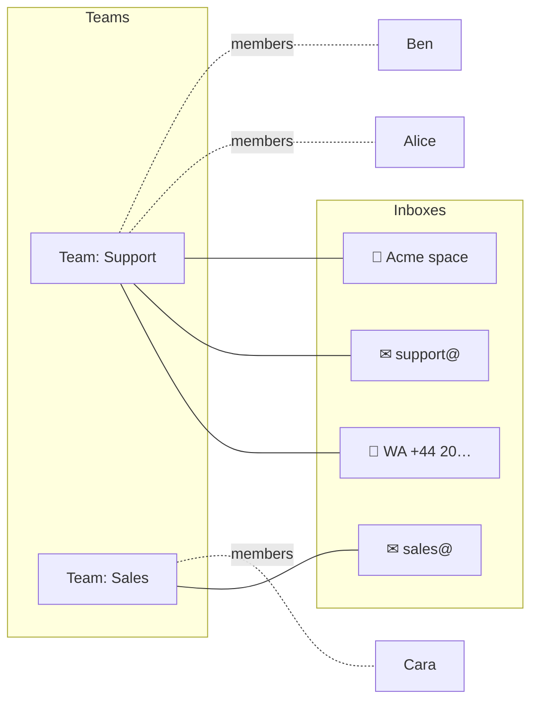
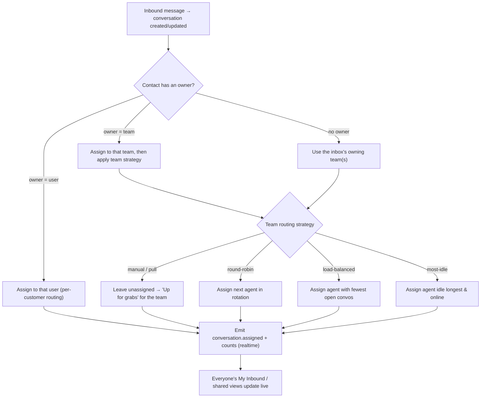
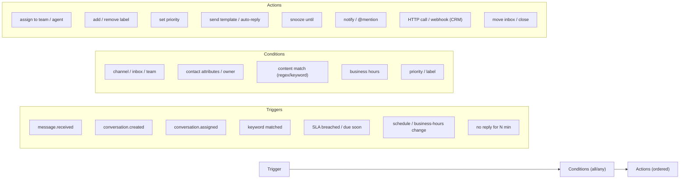

# 05 · Routing, Teams & Workflows

This is the operational heart of Ding: how work finds the right person, how teams share load, and (later) how automation removes the manual steps.

## Concepts

- **Inbox** — a channel endpoint (a WhatsApp number, a group space, an email address). Conversations are born in an inbox.
- **Team** — a named group of users. A team **owns** one or more inboxes and has default routing behaviour.
- **Assignment** — a conversation can be assigned to a **user**, a **team**, both, or neither (unassigned).
- **My Inbound** — the computed personal view: *assigned to me* + *unassigned inbound in my teams' inboxes that's mine to take*.

## The routing engine

Runs on every newly-created (or re-opened) conversation, and on demand for manual moves.

### 1. Auto per-customer routing (a headline requirement)

Each **Contact** can carry an **owner** (`owner_user_id` or `owner_team_id`). When a message comes in from a known client, Ding assigns the conversation to that owner automatically — so a client always reaches "their" person/team. Owners are set:

- manually by an agent/manager ("make me the owner of Acme"),
- by a workflow (e.g. "first agent to close a deal owns the account"),
- or by import from a CRM.

### 2. Team strategies (when there's no per-customer owner)

Configured per inbox or per team:

| Strategy | Behaviour | Good for |
|---|---|---|
| **Manual / pull** | Stays unassigned in the team's **Up for grabs** queue; whoever grabs it owns it | Small teams, high-context work |
| **Round-robin** | Cycles through available agents | Even distribution |
| **Load-balanced** | Assigns to the agent with the fewest open conversations | Fairness under uneven load |
| **Most-idle** | Assigns to the online agent idle longest | Fast pickup |

Modifiers: **online/away** presence, **business hours**, **skills/labels** (e.g. "billing"), **max concurrent** cap per agent, and **fallback** (if nobody's available → hold in Up for grabs + optional alert).

### 3. Manual assignment & reassignment (a headline requirement)

From any conversation (⌘K, right-click, or the context panel) an agent/manager can:

- **Assign to me** / **assign to another agent**,
- **Route to another team** (e.g. Support → Sales) with an optional reason/note,
- **Unassign** (drop it back to Up for grabs).

Every move: updates the conversation, **writes an `AssignmentEvent`** (who, from, to, why, when), and **emits realtime events** so it leaves the old owner's My Inbound and appears in the new team's queue instantly — with attribution ("Ben moved this to Sales").

### 4. Collision control (shared-inbox safety)

Because multiple agents see the same shared inbox, Ding shows **live presence on each conversation** ("Alice is viewing", "Ben is typing to this client") and a **soft-lock warning** if you start replying to something someone else is actively answering. Prevents double-replies without hard-locking anyone out.

## "My Inbound" — precise semantics

A conversation is in user *U*'s **My Inbound** when it's `open`/`pending` **and** either:

- **Mine** — `assignee = U`; or
- **Up for grabs** — `assignee is null` **and** the conversation's inbox is owned by a team *U* belongs to **and** routing rules make it eligible for *U* (e.g. skills match, within business hours, not pre-assigned by round-robin to someone else).

Sub-filters expose the pieces: `Mine · Up for grabs · @Mentions · Following · Snoozed · Drafts · Sent`. The SQL sketch lives in [`docs/04-data-model.md`](04-data-model.md). The realtime layer recomputes membership on each relevant event and pushes deltas, so the sidebar badge and list never go stale.

## Permissions (who can do what)

| Action | Agent | Team lead | Admin |
|---|---|---|---|
| See/handle their teams' inboxes | ✅ | ✅ | ✅ |
| Assign to self / take from Up for grabs | ✅ | ✅ | ✅ |
| Reassign to another agent (same team) | ✅ | ✅ | ✅ |
| Route to another **team** | ⚙ configurable | ✅ | ✅ |
| Create/connect inboxes & set routing | ❌ | ⚙ | ✅ |
| Manage teams, members, workflows | ❌ | ⚙ | ✅ |
| Compliance/retention/audit settings | ❌ | ❌ | ✅ |

RBAC is enforced server-side (role on `User` + team role on `TeamMember`), via WorkOS/Clerk-backed sessions.

---

## Workflows (Phase 5 — designed now, built later)

Swiftee said workflows come later — but we design the seam now so nothing blocks it. A workflow is **Trigger → Conditions → Actions**, event-driven off the same domain events the realtime layer already emits.

**Engine design:**

- Workflows are **JSON-defined** (a trigger, a condition tree, an ordered action list), **versioned**, and **toggleable**. A visual builder renders/edits that JSON.
- Execution runs on **BullMQ workers** subscribed to domain events — off the request path, with retries and idempotency.
- **Dry-run / simulate** against recent conversations before enabling; **audit** every action a workflow takes.
- **Graduation path:** if flows become long-running or multi-step-with-waits (e.g. "wait 2 days, then if still no reply, escalate"), adopt a **durable execution** engine — **Inngest** (great DX, fits our queue model) or **Temporal** (heavy-duty). Start in-house; graduate deliberately.

**Example workflows Swiftee might ship first:**

- *After-hours auto-reply*: `trigger: message.received` + `conditions: outside business hours, first message` → `actions: send "we'll reply at 9am" template, set pending`.
- *VIP fast-lane*: `trigger: conversation.created` + `conditions: contact.label = VIP` → `actions: assign to senior team, priority high, SLA 30m`.
- *Keyword routing*: `trigger: message.received` + `conditions: body matches "invoice|billing"` → `actions: route to Finance team, label billing`.
- *Stale nudge*: `trigger: no reply for 60 min on assigned conversation` → `actions: @mention assignee, escalate to lead if breached`.
