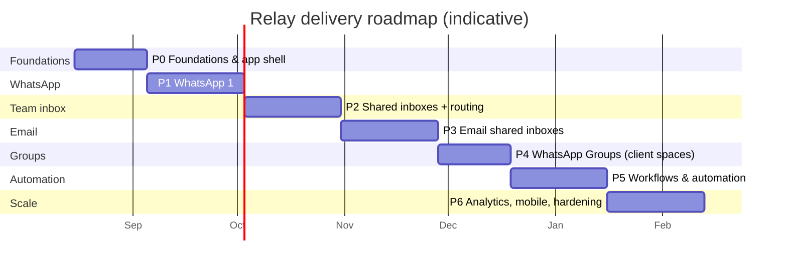

# 06 · Roadmap

A phased plan that ships something usable early and de-risks the hardest parts (WhatsApp, realtime) first. Timeline assumes a **small focused team** (see below); phases overlap.

## Phasing at a glance

> Rough calendar: an MVP Swiftee can use internally (P0–P2) in ~**3 months**; email + groups (P3–P4) by ~**5 months**; workflows + polish (P5–P6) by ~**7 months**. Compresses with more engineers or a Chatwoot fork; treat as directional.

---

## Phase 0 — Foundations (≈3 weeks)

**Goal:** the skeleton everything hangs off; deployable from day one.

- Monorepo (pnpm + Turborepo), shared `schemas`/`ui`/`domain` packages, lint/test/CI.
- Railway project: Postgres + Redis + API + web; per-PR preview envs; Cloudflare DNS/R2.
- Auth (WorkOS/Clerk): org, users, roles, sessions, SSO.
- Core data model + migrations: org, user, team, inbox, contact, conversation, message.
- Realtime skeleton: Socket.IO gateway + Redis adapter; presence; a "hello world" live event.
- **Design system + app shell**: the four-column layout, two-section sidebar, tokens, dark/light. *(Empty but real.)*

**Exit:** a logged-in agent sees the app shell; a test event flows server→client live.

## Phase 1 — WhatsApp 1:1 MVP (≈4 weeks) — *the de-risking phase*

**Goal:** send and receive real WhatsApp 1:1 messages in a beautiful thread, live.

- BSP onboarding (360dialog or Meta-direct) + Embedded Signup for one number.
- WhatsApp gateway: webhook verify, dedupe, normalize; inbound → conversation/message.
- Outbound send (outbox pattern), delivery/read status → ticks; media via R2.
- 24-hour window logic + approved-template picker in the composer.
- Realtime thread, conversation list, contact identity resolution, "assign to me".
- Basic notifications (web push).

**Exit:** Swiftee handles live WhatsApp customer chats in Relay on one number, end-to-end.

## Phase 2 — Shared inboxes, teams & routing (≈4 weeks)

**Goal:** the collaboration + routing that makes it a *team* inbox, not a chat app.

- Inbox ownership by teams; **+ Create inbox**; multiple WhatsApp numbers.
- **My Inbound** (Mine + Up for grabs) and **Shared Inboxes** sidebar sections, fully live.
- Routing engine: per-customer owner, round-robin, load-balanced, manual pull.
- **Manual assign / reassign to another team** with audit + realtime.
- Collision detection & presence on conversations; internal lane (notes + @mentions); labels, priority, snooze, statuses; SLA timers.

**Exit:** multiple agents across teams share numbers, route work, and never collide. **This is the internal-launch milestone.**

## Phase 3 — Email shared inboxes (≈4 weeks)

**Goal:** email as a first-class channel in the same model.

- Gmail + Microsoft Graph OAuth connectors (Mode A); Postmark inbound + SMTP (Mode B).
- MIME parsing, header-based threading, attachments to R2.
- Rich email composer (Tiptap): subject, cc/bcc, signatures, quoting, drafts.
- **Unified Client Space**: WhatsApp + email merged into one contact timeline.

**Exit:** a shared `support@` inbox is handled in Relay with the same routing/collaboration as WhatsApp.

## Phase 4 — WhatsApp Groups / client spaces (≈3 weeks)

**Goal:** small official client groups as first-class "spaces." *(Gated on the ≤8-member validation.)*

- Groups API integration: create group, invite links, participant management, group webhooks.
- Group conversation type + participant model; group-aware composer & templates.
- Client "space" UX in the sidebar (named rooms, pinned info).

**Exit:** Swiftee runs official WhatsApp client groups inside Relay.

## Phase 5 — Workflows & automation (≈4 weeks)

**Goal:** remove manual steps.

- Rules engine (trigger→conditions→actions) on BullMQ; JSON-defined, versioned, dry-run.
- Visual builder; first shipped workflows (after-hours auto-reply, VIP fast-lane, keyword routing, stale nudges).
- Business hours, SLA policies, canned responses library.
- Evaluate Inngest/Temporal if long-running flows appear.

**Exit:** Swiftee automates routing and replies without touching every conversation.

## Phase 6 — Analytics, mobile & hardening (≈4 weeks, then ongoing)

**Goal:** run it at scale and see how it's doing.

- **Insights**: volume, response/resolution times, SLA attainment, per agent/team/inbox.
- **Mobile** app (Expo/React Native) for on-the-go agents + push.
- Search upgrade (Typesense), performance (message partitioning, list virtualization tuning), load testing (k6).
- Enterprise SSO/SCIM polish, retention/erasure tooling, on-call/observability maturity.

**Exit:** production-grade, measurable, mobile-ready.

---

## Suggested team shape

| Role | Phase 0–2 | Phase 3–6 |
|---|---|---|
| Full-stack TS engineer(s) | 2 | 3–4 |
| Product designer (owns the "twist" + design system) | 0.5–1 | 1 |
| WhatsApp/BSP + email integration focus | (shared) | 1 |
| PM / founder-led product | Swiftee | Swiftee |

A tight **2–3 engineer** team can reach the internal-launch milestone (P2). This maps cleanly onto multi-agent build workflows if we want to parallelize the scaffolding.

## Sequencing rationale

1. **WhatsApp before email** — it's the primary channel and the biggest technical/compliance risk; prove it first.
2. **Routing before groups** — the team-inbox mechanics are what make Relay valuable; groups build on them.
3. **Workflows after the manual flows work** — automate a process you already understand, not a hypothetical one.
4. **Validate the 8-member group cap before Phase 4** — it's the one requirement with no compliant fallback.
