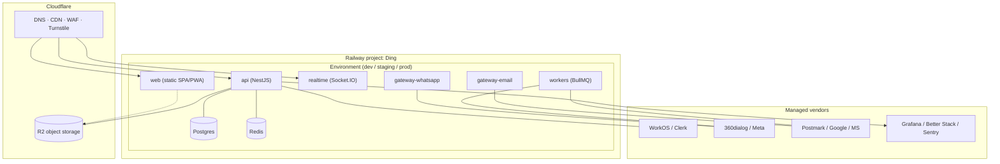

# 07 · Infra, Security & Cost

## Infrastructure (Railway-first)

Swiftee already uses **Railway**, so we build there. Railway gives managed Postgres + Redis, container services, private networking, and per-environment config — enough to run Ding from MVP to solid scale.

### Environments

- **dev** (per-developer / per-PR preview), **staging**, **prod** — separate Railway environments, separate Postgres/Redis, separate WhatsApp test number.
- **Private networking** between services (gateways/workers reach Postgres/Redis internally, not over the public net).
- **IaC**: Railway config committed; **Terraform** for Cloudflare (DNS, R2 buckets, WAF rules).
- **CI/CD**: GitHub Actions runs lint/test/build → deploys to Railway; preview env per PR; migrations gated behind review.
- **Region**: choose an **EU/UK region** for data residency (see compliance).

### Data residency & backups

- Postgres in EU/UK region; **automated backups** + point-in-time recovery; periodic restore drills.
- R2 media in EU jurisdiction; lifecycle rules for old media.
- Redis is ephemeral/derived state (pub-sub, presence, queues) — nothing that can't be rebuilt, but persist BullMQ where jobs must survive restarts.

## Security

| Area | Approach |
|---|---|
| **AuthN** | WorkOS/Clerk — SSO/SAML, MFA, session management; short-lived tokens |
| **AuthZ** | RBAC (org role + team role), enforced server-side; org-scoped queries + optional Postgres **RLS** |
| **Transport** | TLS everywhere; HSTS; WebSocket over WSS |
| **Secrets** | Railway variables / Doppler; never in repo; rotated |
| **Webhooks** | Signature verification (Meta app secret, Postmark token), idempotency keys, replay protection |
| **Data at rest** | Postgres encryption; **column-level encryption** (pgcrypto/app-layer) for sensitive PII (phone, email, message bodies if required) |
| **Media** | Private R2; time-limited **signed URLs**; no public buckets |
| **Rate limiting & abuse** | Per-org/per-IP limits (Redis); Cloudflare WAF + Turnstile on public endpoints |
| **Audit** | `AuditLog` for assignments, inbox/config changes, exports, admin actions |
| **Dependency/supply-chain** | Renovate/Dependabot, `npm audit` in CI, pinned lockfile, SBOM |
| **App security** | Input validation (Zod) at every boundary, output encoding, CSP, parametrized queries (Prisma) |

## Compliance (UK company → UK GDPR + WhatsApp policy)

- **Legal basis & consent**: capture and store **WhatsApp opt-in** per contact; lawful basis recorded for processing.
- **DPAs**: Data Processing Agreements with Meta/BSP, email providers, auth vendor, hosting.
- **Data subject rights**: tooling for **access/export** and **erasure** (delete a contact + their messages/media across Postgres + R2 + search index).
- **Retention**: configurable retention windows per inbox/channel; auto-purge beyond policy.
- **PII minimization**: only store what's needed; encrypt sensitive fields; restrict who can export.
- **Records of processing & breach process**: documented; incident runbook; 72-hour breach notification readiness.
- **WhatsApp-specific**: adhere to Business Messaging Policy, template categories, quality rating; honour opt-outs.
- **Data residency**: EU/UK regions across Railway + Cloudflare + providers.

## Observability & reliability

- **Tracing/metrics**: OpenTelemetry across API, gateways, workers, realtime → Grafana Cloud / Better Stack. Trace a message from webhook → routed → delivered to client UI.
- **Errors**: Sentry (frontend + backend), release-tagged.
- **Logs**: structured (pino), correlation IDs, org-scoped, no secrets/PII in logs.
- **Health & SLOs**: uptime checks; SLOs for *webhook→visible latency*, *send success rate*, *WS delivery latency*; alerting + on-call.
- **Queues**: BullMQ dashboards; dead-letter queues; retry/backoff; alert on backlog.
- **Idempotency & DLQ** on all channel ingestion so provider retries never duplicate or lose messages.

## Cost model (rough, monthly — verify)

Two buckets: **platform run-cost** (fairly fixed, low early) and **usage cost** (scales with WhatsApp/email volume).

### Platform (early stage)

| Item | Indicative |
|---|---|
| Railway (API, realtime, gateways, workers, Postgres, Redis) | ~£50–300 (grows with instances) |
| Cloudflare (DNS/WAF) + R2 storage | ~£5–30 (R2 has no egress fees) |
| Auth (WorkOS/Clerk) | Free tier → ~£20–200 as users grow |
| Email provider (Postmark) | from ~£12; scales with volume |
| Observability (Sentry + Grafana/Better Stack) | Free tiers → ~£20–100 |
| **Subtotal** | **~£100–600/mo early**, scaling with usage |

### WhatsApp usage (the variable that matters)

- **Service replies** (free-form inside the 24h window): **free until 1 Oct 2026**, then billed at the utility/auth rate.
- **Templates**: billed per message by category × country — UK marketing ~£0.038; utility/auth low pence.
- **BSP markup**: ~$0.003–$0.010/msg (or bundled).
- **Model it**: `monthly ≈ (template msgs × category rate) + (post-Oct-2026 service msgs × util rate) + BSP markup`. For a support-led use case dominated by free service replies, near-term WhatsApp cost is low; it rises with proactive/template messaging and after the Oct-2026 service-message change.

### Cost levers

- Prefer **service-window** replies over templates where possible (free today).
- Right-size Railway instances; autoscale workers on queue depth.
- R2 over S3 (no egress); lifecycle-expire old media.
- Start search in Postgres; add Typesense only when needed.

> All figures are directional starting points for budgeting, not quotes. Confirm current Railway, Cloudflare, provider, and Meta pricing before committing.
